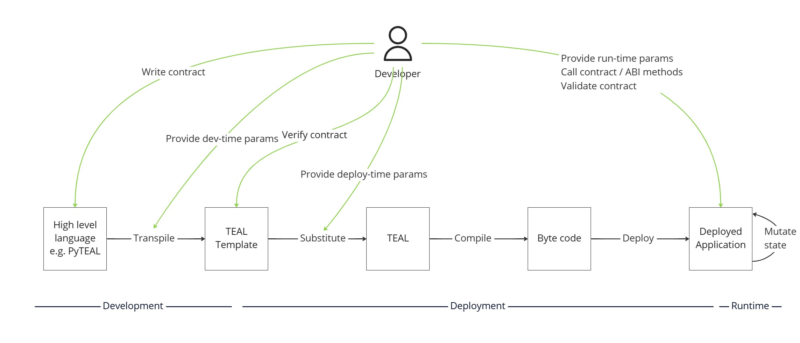

# App deployment

AlgoKit contains advanced smart contract deployment capabilities that allow you to have idempotent (safely retryable) deployment of a named app, including deploy-time immutability and permanence control and TEAL template substitution. This allows you to control the smart contract development lifecycle of a single-instance app across multiple environments (e.g. LocalNet, TestNet, MainNet).

It's optional to use this functionality, since you can construct your own deployment logic using create / update / delete calls and your own mechanism to maintaining app metadata (like app IDs etc.), but this capability is an opinionated out-of-the-box solution that takes care of the heavy lifting for you.

App deployment is a higher-order use case capability provided by AlgoKit Utils that builds on top of the core capabilities, particularly [App management](./app.md).

To see some usage examples check out the [automated tests](https://github.com/algorandfoundation/algokit-utils-py/blob/main/tests/test_deploy_scenarios.py).

## Smart contract development lifecycle

The design behind the deployment capability is unique. The architecture design behind app deployment is articulated in an [architecture decision record](https://github.com/algorandfoundation/algokit-cli/blob/main/docs/architecture-decisions/2023-01-12_smart-contract-deployment.md). While the implementation will naturally evolve over time and diverge from this record, the principles and design goals behind the design are comprehensively explained.

Namely, it described the concept of a smart contract development lifecycle:

1. Development
   1. **Write** smart contracts
   2. **Transpile** smart contracts with development-time parameters (code configuration) to TEAL Templates
   3. **Verify** the TEAL Templates maintain [output stability](https://github.com/algorandfoundation/algokit-cli/blob/main/docs/articles/output_stability.md) and any other static code quality checks
2. Deployment
   1. **Substitute** deploy-time parameters into TEAL Templates to create final TEAL code
   2. **Compile** the TEAL to create byte code using algod
   3. **Deploy** the byte code to one or more Algorand networks (e.g. LocalNet, TestNet, MainNet) to create Deployed Application(s)
3. Runtime
   1. **Validate** the deployed app via automated testing of the smart contracts to provide confidence in their correctness
   2. **Call** deployed smart contract with runtime parameters to utilise it



The App deployment capability provided by AlgoKit Utils helps implement **#2 Deployment**.

Furthermore, the implementation contains the following implementation characteristics per the original architecture design:

- Deploy-time parameters can be provided and substituted into a TEAL Template by convention (by replacing `TMPL_{KEY}`)
- Contracts can be built by any smart contract framework that supports [ARC-56](https://github.com/algorandfoundation/ARCs/blob/main/ARCs/arc-0056.md) and [ARC-32](https://github.com/algorandfoundation/ARCs/pull/150), which also means the deployment language can be different to the development language e.g. you can deploy a Python smart contract with TypeScript for instance
- There is explicit control of the immutability (updatability / upgradeability) and permanence (deletability) of the smart contract, which can be varied per environment to allow for easier development and testing in non-MainNet environments (by replacing `TMPL_UPDATABLE` and `TMPL_DELETABLE` at deploy-time by convention, if present)
- Contracts are resolvable by a string "name" for a given creator to allow automated determination of whether that contract had been deployed previously or not, but can also be resolved by ID instead

This design allows you to have the same deployment code across environments without having to specify an ID for each environment. This makes it really easy to apply [continuous delivery](https://continuousdelivery.com/) practices to your smart contract deployment and make the deployment process completely automated.

## `AppDeployer`

The {py:obj}`AppDeployer <algokit_utils.app_deployer.AppDeployer>` is a class that is used to manage app deployments and deployment metadata.

To get an instance of `AppDeployer` you can use either [`AlgorandClient`](./algorand-client.md) via `algorand.appDeployer` or instantiate it directly (passing in an [`AppManager`](./app.md#appmanager), [`AlgorandClientTransactionSender`](./algorand-client.md#sending-a-single-transaction) and optionally an indexer client instance):

```python
from algokit_utils.app_deployer import AppDeployer

app_deployer = AppDeployer(app_manager, transaction_sender, indexer)
```

## Deployment metadata

When AlgoKit performs a deployment of an app it creates metadata to describe that deployment and includes this metadata in an [ARC-2](https://github.com/algorandfoundation/ARCs/blob/main/ARCs/arc-0002.md) transaction note on any creation and update transactions.

The deployment metadata is defined in {py:obj}`AppDeployMetadata <algokit_utils.models.app_deployer.AppDeployMetadata>`, which is an object with:

- `name: str` - The unique name identifier of the app within the creator account
- `version: str` - The version of app that is / will be deployed; can be an arbitrary string, but we recommend using [semver](https://semver.org/)
- `deletable: bool | None` - Whether or not the app is deletable (`true`) / permanent (`false`) / unspecified (`None`)
- `updatable: bool | None` - Whether or not the app is updatable (`true`) / immutable (`false`) / unspecified (`None`)

An example of the ARC-2 transaction note that is attached as an app creation / update transaction note to specify this metadata is:

```
ALGOKIT_DEPLOYER:j{name:"MyApp",version:"1.0",updatable:true,deletable:false}
```

> NOTE: Starting from v3.0.0, AlgoKit Utils no longer automatically increments the contract version by default. It is end user's responsibility to explicitly manage versioning of their smart contracts (if desired).

## Lookup deployed apps by name

In order to resolve what apps have been previously deployed and their metadata, AlgoKit provides a method that does a series of indexer lookups and returns a map of name to app metadata via `get_creator_apps_by_name(creator_address)`.

```python
app_lookup = algorand.app_deployer.get_creator_apps_by_name("CREATORADDRESS")
app1_metadata = app_lookup.apps["app1"]
```

This method caches the result of the lookup, since it's a reasonably heavyweight call (N+1 indexer calls for N deployed apps by the creator). If you want to skip the cache to get a fresh version then you can pass in a second parameter `ignore_cache=True`. This should only be needed if you are performing parallel deployments outside of the current `AppDeployer` instance, since it will keep its cache updated based on its own deployments.

The return type of `get_creator_apps_by_name` is {py:obj}`ApplicationLookup <algokit_utils.models.app_deployer.ApplicationLookup>`, which is an object with:

```python
@dataclasses.dataclass
class ApplicationLookup:
    creator: str
    apps: dict[str, ApplicationMetaData] = dataclasses.field(default_factory=dict)
```

The `apps` property contains a lookup by app name that resolves to the current {py:obj}`ApplicationMetaData <algokit_utils.models.app_deployer.ApplicationMetaData>`.

> Refer to the {py:obj}`ApplicationLookup <algokit_utils.models.app_deployer.ApplicationLookup>` for latest information on exact types.

## Performing a deployment

In order to perform a deployment, AlgoKit provides the {py:meth}`deploy <algokit_utils.app_deployer.AppDeployer.deploy>` method.

For example:

```python
deployment_result = algorand.app_deployer.deploy(
    AppDeployParams(
        metadata=AppDeploymentMetaData(
            name="MyApp",
            version="1.0.0",
            deletable=False,
            updatable=False,
        ),
        create_params=AppCreateParams(
            sender="CREATORADDRESS",
            approval_program=approval_teal_template_or_byte_code,
            clear_state_program=clear_state_teal_template_or_byte_code,
            schema=StateSchema(
                global_ints=1,
                global_byte_slices=2,
                local_ints=3,
                local_byte_slices=4,
            ),
            # Other parameters if a create call is made...
        ),
        update_params=AppUpdateParams(
            sender="SENDERADDRESS",
            # Other parameters if an update call is made...
        ),
        delete_params=AppDeleteParams(
            sender="SENDERADDRESS",
            # Other parameters if a delete call is made...
        ),
        deploy_time_params={
            "VALUE": 1,  # TEAL template variables to replace
        },
        on_schema_break=OnSchemaBreak.Append,
        on_update=OnUpdate.Update,
        send_params=SendParams(
            populate_app_call_resources=True,
            # Other execution control parameters
        ),
    )
)
```

This method performs an idempotent (safely retryable) deployment. It will detect if the app already exists and if it doesn't it will create it. If the app does already exist then it will:

- Detect if the app has been updated (i.e. the program logic has changed) and either fail, perform an update, deploy a new version or perform a replacement (delete old app and create new app) based on the deployment configuration.
- Detect if the app has a breaking schema change (i.e. more global or local storage is needed than were originally requested) and either fail, deploy a new version or perform a replacement (delete old app and create new app) based on the deployment configuration.

It will automatically [add metadata to the transaction note of the create or update transactions](#deployment-metadata) that indicates the name, version, updatability and deletability of the contract. This metadata works in concert with [`appDeployer.get_creator_apps_by_name`](#lookup-deployed-apps-by-name) to allow the app to be reliably retrieved against that creator in it's currently deployed state. It will automatically update it's lookup cache so subsequent calls to `get_creator_apps_by_name` or `deploy` will use the latest metadata without needing to call indexer again.

`deploy` also automatically executes [template substitution](#compilation-and-template-substitution) including deploy-time control of permanence and immutability if the requisite template parameters are specified in the provided TEAL template.

### Input parameters

The first parameter `deployment` is an {py:obj}`AppDeployParams <algokit_utils.models.app_deployer.AppDeployParams>`, which is an object with:

- `metadata: AppDeployMetadata` - determines the [deployment metadata](#deployment-metadata) of the deployment
- `create_params: AppCreateParams | CreateCallABI` - the parameters for an [app creation call](./app.md) (raw parameters or ABI method call)
- `update_params: AppUpdateParams | UpdateCallABI` - the parameters for an [app update call](./app.md) (raw parameters or ABI method call) without the `app_id`, `approval_program`, or `clear_state_program` as these are handled by the deploy logic
- `delete_params: AppDeleteParams | DeleteCallABI` - the parameters for an [app delete call](./app.md) (raw parameters or ABI method call) without the `app_id` parameter
- `deploy_time_params: TealTemplateParams | None` - optional parameters for [TEAL template substitution](#compilation-and-template-substitution)
  - {py:obj}`TealTemplateParams <algokit_utils.models.app_deployer.TealTemplateParams>` is a dict that replaces `TMPL_{key}` with `value` (strings/Uint8Arrays are properly encoded)
- `on_schema_break: OnSchemaBreak | str | None` - determines {py:obj}`OnSchemaBreak <algokit_utils.models.app_deployer.OnSchemaBreak>` if schema requirements increase (values: 'replace', 'fail', 'append')
- `on_update: OnUpdate | str | None` - determines {py:obj}`OnUpdate <algokit_utils.models.app_deployer.OnUpdate>` if contract logic changes (values: 'update', 'replace', 'fail', 'append')
- `existing_deployments: ApplicationLookup | None` - optional pre-fetched app lookup data to skip indexer queries
- `ignore_cache: bool | None` - if True, bypasses cached deployment metadata
- Additional fields from {py:obj}`SendParams <algokit_utils.models.app_deployer.SendParams>` - transaction execution parameters

### Idempotency

`deploy` is idempotent which means you can safely call it again multiple times and it will only apply any changes it detects. If you call it again straight after calling it then it will do nothing.

### Compilation and template substitution

When compiling TEAL template code, the capabilities described in the [above design](#smart-contract-development-lifecycle) are present, namely the ability to supply deploy-time parameters and the ability to control immutability and permanence of the smart contract at deploy-time.

In order for a smart contract to opt-in to use this functionality, it must have a TEAL Template that contains the following:

- `TMPL_{key}` - Which can be replaced with a number or a string / byte array which will be automatically hexadecimal encoded (for any number of `{key}` => `{value}` pairs)
- `TMPL_UPDATABLE` - Which will be replaced with a `1` if an app should be updatable and `0` if it shouldn't (immutable)
- `TMPL_DELETABLE` - Which will be replaced with a `1` if an app should be deletable and `0` if it shouldn't (permanent)

If you passed in a TEAL template for the `approval_program` or `clear_state_program` (i.e. a `str` rather than a `bytes`) then `deploy` will return the {py:obj}`CompiledTeal <algokit_utils.models.app_deployer.CompiledTeal>` of substituting then compiling the TEAL template(s) in the following properties of the return value:

- `compiled_approval: CompiledTeal | None`
- `compiled_clear: CompiledTeal | None`

Template substitution is done by executing `algorand.app.compile_teal_template(teal_template_code, template_params, deployment_metadata)`, which in turn calls the following in order and returns the compilation result per above (all of which can also be invoked directly):

- `AppManager.strip_teal_comments(teal_code)` - Strips out any TEAL comments to reduce the payload that is sent to algod and reduce the likelihood of hitting the max payload limit
- `AppManager.replace_template_variables(teal_template_code, template_values)` - Replaces the template variables by looking for `TMPL_{key}`
- `AppManager.replace_teal_template_deploy_time_control_params(teal_template_code, params)` - If `params` is provided, it allows for deploy-time immutability and permanence control by replacing `TMPL_UPDATABLE` with `params.get("updatable")` if not `None` and replacing `TMPL_DELETABLE` with `params.get("deletable")` if not `None`
- `algorand.app.compile_teal(teal_code)` - Sends the final TEAL to algod for compilation and returns the result including the source map and caches the compilation result within the `AppManager` instance

#### Making updatable/deletable apps

Below is a sample in [Algorand Python SDK](https://github.com/algorandfoundation/puya) that demonstrates how to make an app updatable/deletable smart contract with the use of `TMPL_UPDATABLE` and `TMPL_DELETABLE` template parameters.

```python
# ... your contract code ...
@arc4.baremethod(allow_actions=["UpdateApplication"])
def update(self) -> None:
    assert TemplateVar[bool](UPDATABLE_TEMPLATE_NAME)

@arc4.baremethod(allow_actions=["DeleteApplication"])
def delete(self) -> None:
    assert TemplateVar[bool](DELETABLE_TEMPLATE_NAME)
# ... your contract code ...
```

Alternative example in [Algorand TypeScript SDK](https://github.com/algorandfoundation/puya-ts):

```typescript
// ... your contract code ...
@baremethod({ allowActions: 'UpdateApplication' })
public onUpdate() {
    assert(TemplateVar<boolean>('UPDATABLE'))
}

@baremethod({ allowActions: 'DeleteApplication' })
public onDelete() {
    assert(TemplateVar<boolean>('DELETABLE'))
}
// ... your contract code ...
```

With the above code, when deploying your application, you can pass in the following deploy-time parameters:

```python
my_factory.deploy(
    ... # other deployment parameters ...
    compilation_params={
        "updatable": True, # resulting app will be updatable, and this metadata will be set in the ARC-2 transaction note
        "deletable": False, # resulting app will not be deletable, and this metadata will be set in the ARC-2 transaction note
    }
)
```

### Return value

When `deploy` executes it will return a {py:obj}`AppDeployResult <algokit_utils.models.app_deployer.AppDeployResult>` object that describes exactly what it did and has comprehensive metadata to describe the end result of the deployed app.

The `deploy` call itself may do one of the following (which you can determine by looking at the `operation_performed` field on the return value from the function):

- `OperationPerformed.CREATE` - The smart contract app was created
- `OperationPerformed.UPDATE` - The smart contract app was updated
- `OperationPerformed.REPLACE` - The smart contract app was deleted and created again (in an atomic transaction)
- `OperationPerformed.NOTHING` - Nothing was done since it was detected the existing smart contract app deployment was up to date

As well as the `operation_performed` parameter and the [optional compilation result](#compilation-and-template-substitution), the return value will have the {py:obj}`ApplicationMetaData <algokit_utils.applications.app_deployer.ApplicationMetaData>` [fields](#deployment-metadata) present.

Based on the value of `operation_performed`, there will be other data available in the return value:

- If `CREATE`, `UPDATE` or `REPLACE` then it will have the relevant {py:obj}`SendAppTransactionResult <algokit_utils.transactions.transaction_sender.SendAppTransactionResult>` values:
  - `create_result` for create operations
  - `update_result` for update operations
- If `REPLACE` then it will also have `delete_result` to capture the result of deleting the existing app
